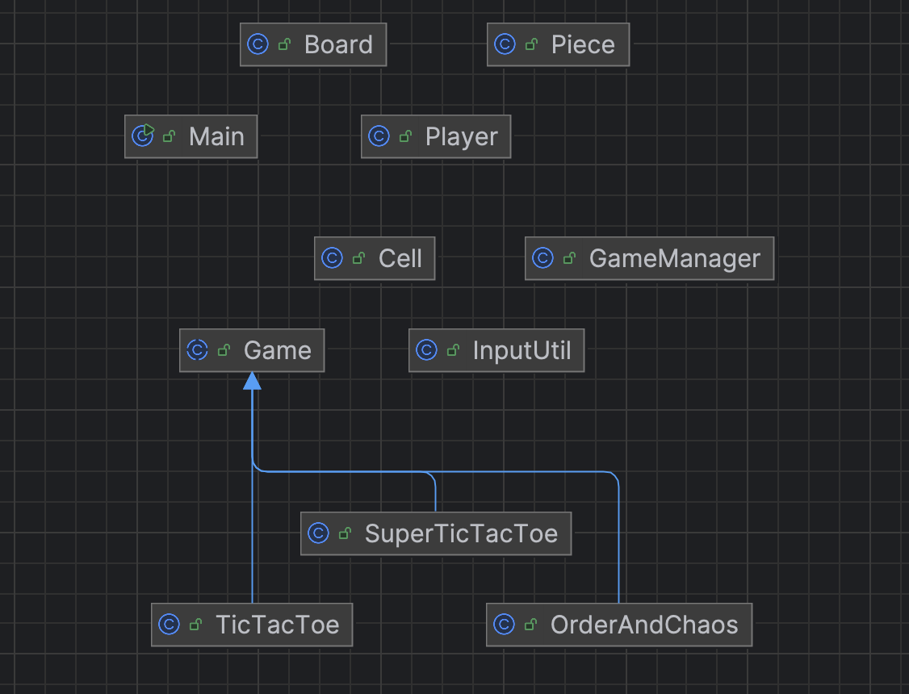

**Design Document**

My UML diagram:

The UML Diagram represents the turn-based board game system design to support mutiple game variants, as show in diagram, it currently contains three different game. The structure shows class hierarchy that allow for scalability and extendibility, such making it easy to reuse funationalities and add new games or modify existing ones. 

The Game class is an abstract base class where it acts as a base for different games. it defines common properties that is required for each game. Abstract methods like initializePlayer() and playTurn() ensures that subclasses implement the game logic.

The subclasses are TicTacToe, OrderAndChaos, and SuperTicTacToe. Each of the class extends the Game class and implements the game in a more specific way. The design allow each subclass to handle unique game mechanics while adhering common interfaces by Game class.

The Board and Cell class can be used for all the games that needs a board and a cell to store symbol/piece. It can vary in size and structure based on the game variant. It is designed to be flexible and reusable to allow different game variants.

The InputUtil class is meant to be reuse frequently to validate user inputs. It helps ensure the game's consistency and avoid bugs with mistake inputs. Also easy to rewrite or change validations since it is all in one place.

The GameManager handles the flow of each game, and with it, is can be easily keep track of each game.

The player and piece class both will easily extended and it ensures player's unique identity for different game variants.

The Main class provides the interface for the entry point of the program, and invoking the GameManger to start a game. 

